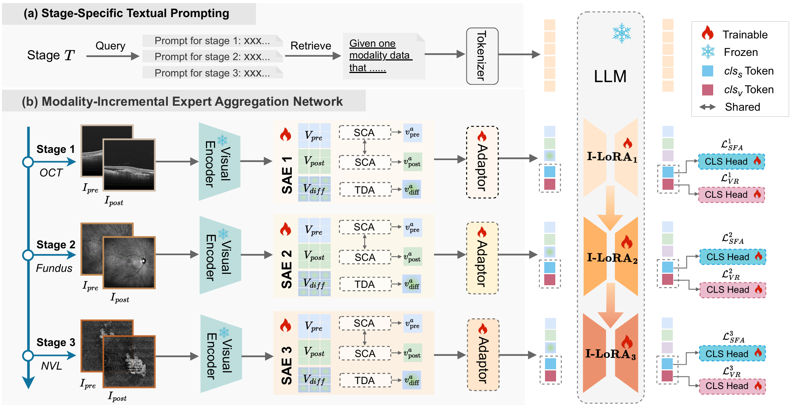

# MoEA-Net: Modality-Incremental Expert Aggregation Network for Retinal Prognostic Prediction

Official implementation of MoEA-Net (AAAI 2026).

**[Paper](https://ojs.aaai.org/index.php/AAAI/article/view/37946)**

## Abstract

Automated analysis of temporal changes in multimodal retinal images is critical for the prognostic assessment of ophthalmic diseases.
Unlike traditional single-timepoint diagnosis, tracking longitudinal changes across multiple imaging modalities introduces significant data bias challenges: (1) Imbalanced modality samples compromise the integration of knowledge within minority modalities; (2) Heterogeneous visual patterns across modalities undermine the perception of disease-relevant biomarkers.
To tackle these issues, we propose a Modality-Incremental Expert Aggregation Network (MoEA-Net), which unifies the inter-modal integration and intra-modal perception for enhanced retinal prognostic prediction.
Specifically, we employ the large language model (LLM) with incremental LoRA layers for specific modalities to effectively integrate knowledge from imbalanced data.
Besides, we introduce a Spatiotemporal-aware Expert (SAE) module to better perceive both the anatomical structures and longitudinal changes within modalities.
By progressively combining the SAE module with incremental LoRA, MoEA-Net supports continual knowledge accumulation and improves accurate reasoning.
Experimental results show that MoEA-Net achieves state-of-the-art performance on subretinal fluid change and visual recovery classification tasks, validating its effectiveness.



## Environment

Python 3.11 and a CUDA-capable GPU are required.

```bash
pip install -r requirements.txt
```

## Data and Pretrained Models

The AMD-OCTA clinical dataset is not included. Prepare `train.json`, `val.json`, and `test.json` under a split directory, and paired before/after images under an image directory. Each record must contain `sample_id`, `modalitys`, and `findings`. The three modalities are `oct`, `fundus`, and `faz` (`NVL` in the paper). See [`oct_eye_dataset.py`](llama_recipes/datasets/oct_eye_dataset.py) for the image naming and label format.

For sample `12345`, OCT images include `Samples/123_4_5/12345_OS_oct_before.jpg` and `Samples/123_4_5/12345_OS_oct_after.jpg`.

Download [Meta-Llama-3-8B-Instruct](https://huggingface.co/meta-llama/Meta-Llama-3-8B-Instruct) to a local directory. Download [BiomedCLIP](https://huggingface.co/microsoft/BiomedCLIP-PubMedBERT_256-vit_base_patch16_224) and place `open_clip_config.json` and `open_clip_pytorch_model.bin` in `checkpoints/`.

## Training

Run from the repository root. One command trains the OCT, OCT + fundus, and OCT + fundus + FAZ stages in order:

```bash
python recipes/moeanet/train_moeanet.py \
  --model_name "/path/to/Meta-Llama-3-8B-Instruct" \
  --vision_encoder_path "checkpoints" \
  --dataset_directory "/path/to/Splits" \
  --image_directory "/path/to/Samples" \
  --stage_batch_sizes '[32,32,32]' \
  --stage_epochs '[60,50,40]' \
  --warmup_epochs 4 \
  --lr 0.0001 \
  --lora_lr 0.00002 \
  --fluid_loss_weight 1.0 \
  --vision_loss_weight 2.0 \
  --expert_temperature 0.6 \
  --output_dir "runs/moeanet/First_Stage" \
  --quantization \
  --save_metrics
```

The best checkpoints are saved in `runs/moeanet/First_Stage/`, `runs/moeanet/Second_Stage/`, and `runs/moeanet/Third_Stage/`.

## Evaluation

Use the same model, data, and output paths as training:

```bash
python recipes/moeanet/test_moeanet.py \
  --model_name "/path/to/Meta-Llama-3-8B-Instruct" \
  --vision_encoder_path "checkpoints" \
  --dataset_directory "/path/to/Splits" \
  --image_directory "/path/to/Samples" \
  --stage_batch_sizes '[32,32,32]' \
  --expert_temperature 0.6 \
  --output_dir "runs/moeanet/First_Stage" \
  --quantization
```

Keep `--expert_temperature` the same as training; new checkpoints validate this value when loaded.

## Acknowledgements

This repository reuses and adapts selected training, configuration, and LLaMA model utilities from Meta's open-source [llama-recipes](https://github.com/meta-llama/llama-recipes) project.

## Citation

```bibtex
@inproceedings{wang2026moeanet,
  title     = {MoEA-Net: Modality-Incremental Expert Aggregation Network for Retinal Prognostic Prediction},
  author    = {Wang, Hua and Zhang, Xiaodan and Shi, Yanzhao and Zheng, Chengxin and Zhang, Wanyu and Wang, Zhen and Wang, Jianing and Yu, Xiaobing},
  booktitle = {Proceedings of the AAAI Conference on Artificial Intelligence},
  volume    = {40},
  number    = {12},
  pages     = {9820--9828},
  year      = {2026},
  doi       = {10.1609/aaai.v40i12.37946}
}
```
